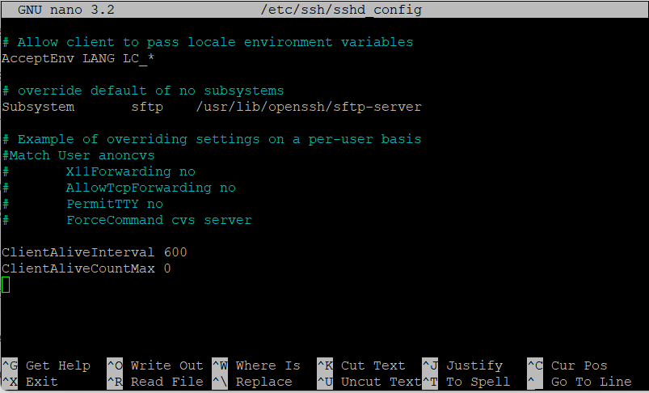
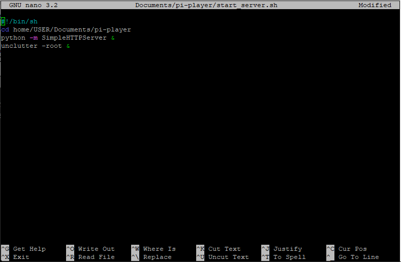
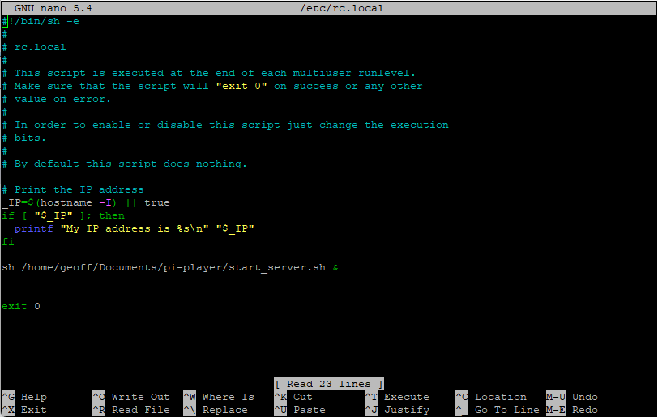
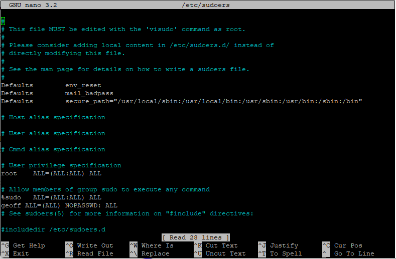

# View Album Artwork on a Remote Screen
## About
Peerless-Pi-Player enables you to view album art and track details of the current playing song in Peerless Player on a remote screen, such as your flat-screen TV or remote monitor using a Raspberry Pi. It will be compatible to run on any Raspberry Pi display with a height resolution greater than 700 pixels.

The software for the Pi-Player runs on a Raspberry Pi, which connects to your remote screen with an HDMI cable or directly to a Raspberry Pi using the 40 pin connector or a DSI cable. The Raspberry Pi is connected by Wi-Fi to your home network and works as a minion to Peerless Player. When a song plays on Peerless Player it sends by SFTP the album artwork jpg file and a json file with the song data to the Pi-Player, which then displays them in a full screen Chromium browser on the remote screen.

The Raspberry Pi is controlled from a menu in Peerless Player. So all you have to do is plug in the HDMI and power to the Raspberry Pi and once it has booted up, click on Open Pi-Player from the menu.

For more information about Peerless Player visit the website here: <a href="https://www.peerlessplayer.rocks">www.peerlessplayer.rocks</a>

## Build Instructions

### Hardware

You will need a basic Raspberry Pi starter kit. I am using a Raspberry Pi 3 Model A+.

- Raspberry Pi 3 or above.
- Official Raspberry Pi Power Supply.
- 16gb Micro SD Card or above.
- A case of your choice. I have used the Pibow 3 A+ Coupé.
- HDMI cable.

### Set up the Raspberry Pi

To complete the set up you will need a USB mouse and keyboard. Follow these instructions to get your Pi up and running.

<a href="https://projects.raspberrypi.org/en/projects/raspberry-pi-setting-up/0">Raspberry Pi Foundation - Setting up your Raspberry Pi</a>

If you do not have a USB mouse and keyboard it is possible, but more technical to complete the set up following the below instructions.

<a href="https://www.hackster.io/mark-hank/super-simple-headless-raspberry-pi-setup-5382d6">Hackster.io - Simple Headless Raspberry Pi Setup</a>

### Download Peerless-Pi-Player Code

1. Go to the Peerless-Pi-Player Github page from the following link: <a href="https://github.com/MrPeerless/peerless-pi-player">Github.com peerless-pi-player</a>.

2. Click on the green Code button and select Download ZIP from the dropdown menu.

	 

3. Extract the files from the compressed folder in your Downloads folder.

4. In File Explorer, navigate to the **pi-player** folder and copy this and it's contents to your Raspberry Pi folder **USER/Documents** replacing USER with your Pi user name.

		USER/Documents

5. ***IMPORTANT NOTE!*** The file path for the Peerless-Pi-Player code is hard coded into Peerless Player. If you change this filepath (apart from your User Name) the code will not work. The filepath should look like this: <b>/Home/USER/Documents/pi-player</b>

### Set up Peerless-Pi-Player

1. Allow the Raspberry Pi to be controlled remotely over your home network.
	- Go to Raspberry Pi Configuration - Interfaces
	- Enable SSH
	- Create public/private key pair to be used as authentication, instead of a password, between your Windows machine and the Raspberry Pi. Follow instructions at the link below to create a key pair:
	- <a href="https://endjin.com/blog/2019/09/passwordless-ssh-from-windows-10-to-raspberry-pi">Passwordless SSH from Windows 10 to Raspberry Pi</a>

2. Automatically disconnect idle SSH sessions. Peerless Player sends an SFTP and BASH command to the Raspberry Pi whenever a new track is played. If these SSH sessions are not disconnected the Raspberry Pi will eventually slow down.
	- In the terminal type the following command to edit the <b>sshd_config</b> file.

			$ sudo nano /etc/ssh/sshd_config

	- At the end of the file add the below 2 lines. The first line is the time interval, in seconds, to keep idle sessions alive.

			ClientAliveInterval 600
			ClientAliveCountMax 0

	- Save the file by pressing <b>Ctrl X, Y, Enter</b>

		 

3. Stop your Raspberry Pi from going to sleep.
	- Go to Raspberry Pi Configuration - Display
	- Disable screen blanking

4. Turn off Bluetooth
	- At the top of the desktop screen, click on the bluetooth icon to turn off.

5. Turn off  below Chromium settings to increase performance.
	- Chromium - Settings - System

		- Turn off - Continue running background apps when Chromium is closed
		- Turn off - Use hardware acceleration when available

	- Chromium - Settings - Extensions

		- Turn off all extensions

	- Chromium - More Tools - Developer Tools

		- On Network tab select the Disable Cache tick box

6. To hide the mouse cursor from the screen install the program **unclutter**
	- In the terminal type in the following command to install

			$ sudo apt install unclutter sed

7. Amend the USER name in the **start_server.sh** file.
	
	- In the terminal type the following command to edit the **start_server.sh** file.

			$ sudo nano Documents/pi-player/start_server.sh

	- Amend the second line by replacing USER with your Pi user name.

	- Depending on which version of Python your Pi is running, amend the third line. The file by default is set up for Python2, to change to Python3 amend line 3 with the below code:

			python -m http.server &

	- Save the file by pressing **Ctrl X, Y, Enter**

		 

8. Convert the **start_server.sh** file from DOS to UNIX. (The file was written on Windows and saved as DOS but needs to run on Linux and saved as Unix)

	- In the terminal type the following commands to convert the file.

			$ cd Documents/pi-player
			$ dos2unix start_server.sh

	- **Note.** If this command does not work you will need to install dos2unix on your pi using this command:	

			$ sudo apt install dos2unix

9. The **start_server.sh** file needs to run when the Raspberry Pi boots up to automatically start the Python Server and run the Unclutter program.

	- In the terminal type the following command to edit the **rc.local** file

			$ sudo nano /etc/rc.local
	
	- Scroll down to the line above **exit 0** and type in the following line, replacing USER with your Pi user name:

			sh /home/USER/Documents/pi-player/start_server.sh &

	- Save the file by pressing **Ctrl X, Y, Enter**

		 

10. Reboot your Raspberry Pi with the below command and you are all set up and ready to go.

		$ sudo reboot

## Setting Up and Using Peerless-Pi-Player

1. Find and make a note of your Raspberry Pi's IP address. This can be found by either logging into your home router and looking at Your Devices or type the below command into the Raspberry Pi terminal. The IP address is the first string of numbers

		$ hostname -I 

2. In Peerless Player on the top menu bar, click on Pi-Player and from the drop down box select **Pi-Player Settings**.

3. In the settings page enter your Raspberry Pi's IP address, your User Name and Password into the respective input boxes and click on Save.

4. Connect the HDMI cable from your remote screen to your Raspberry Pi and plug in the power cable, which will automatically start the boot up process.

5. Once the Raspberry Pi has booted up, from the Pi-Player option on the top menu bar of Peerless Player, click on **Open Pi-Player**

6. Start playing your music and now enjoy seeing the album artwork and track details on your remote screen.

7. The Raspberry Pi can be controlled from the Pi-Player menu in Peerless Player. You can close Pi-Player and reboot or shutdown the Raspberry Pi.

8. **Note.** If you find the reboot and shutdown functions do not operate from Peerless Player, this is because your Pi requires a password to carry out these operations. To fix this, in the Raspberry Pi terminal edit the following file with the command:
		
		$ sudo nano /etc/sudoers

	At the end of the file add the following 3 lines of code, replacing <i>userName</i> in line 3 with your Pi user name:

		# Allow members of group sudo to execute any command
		%sudo   ALL=(ALL:ALL) ALL
		userName ALL=(ALL) NOPASSWD: ALL
	
	 
<!--

-->
